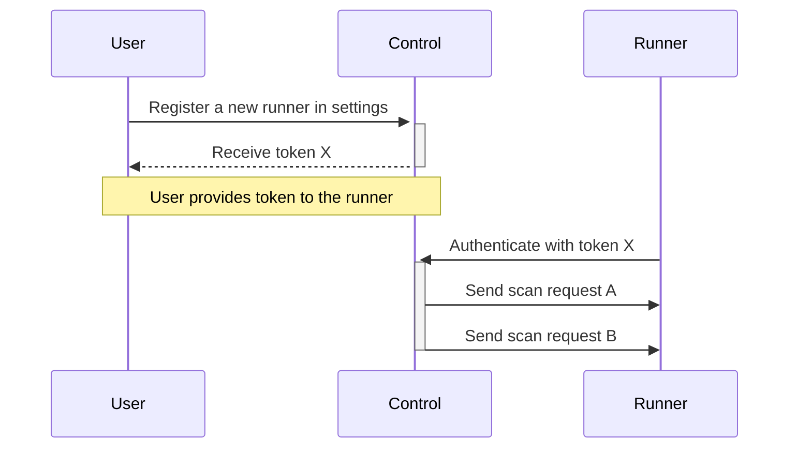

# Chicon runner

[](https://saluki.semaphoreci.com/projects/chicon-runner)
[](https://deps.rs/repo/github/kongbytes/chicon-runner)

This runner is part of the Chicon project and performs code scans in containers based on Chicon scheduler requests. The runner is written in Rust and uses rootless `nerdctl` for secure container management.

## Requirements

The following components are required in `$PATH` for the runner to work:
- [git](https://git-scm.com/) - for repository managament
- [nerdctl](https://github.com/containerd/nerdctl) with CNI plugins - for container management

The Chicon scheduler should be ready and reachable by the runner (by default, `localhost:3000` will be used). Register a runner in the settings in order to obtain a runner token.

## Getting started

Download the `chicon-runner` binary for Linux (Ubuntu, Fedora, Debian, ...). See the [releases page](https://github.com/kongbytes/chicon-runner/releases) for other binaries.

```sh
wget -O chicon-runner https://github.com/kongbytes/chicon-runner/releases/download/v0.1.0-beta.2/chicon-runner && chmod +x ./chicon-runner
```

Create a workspace directory named `chicon-workspace`. This directory will be managed by the runner and used for storing Git repositories.

```sh
mkdir chicon-workspace
```

Launch the runner with a CHICON_TOKEN environment variable

```sh
# The CHICON_TOKEN environment will be used to authenticate the runner
 export CHICON_TOKEN={runner token}

# Launch the runner
chicon-runner run
```

The runner should now be marked as active in the Chicon settings page.

## How it works

A basic runner register process can be found below. The "User" represents an end-user with access to the Chicon control plane settings. The "Control" represents a running instance of the Chicon control plane & scheduler. 



## Configuration

The Chicon runner will try to build a configuration by performing a lookup process:

- Find a file provided by the `--config` option
- Find a `/etc/chicon/runner.toml` file
- Find a `./runner.toml` file
- Build the default config _(not recommended for production)_

A complete reference of the Chicon configuration file can be found below.

```toml
[workspace]

# Workspace path for storing code - this should be an absolute
# path to an empty directory for optimal results.
# Default set to 'chicon-workspace' in current directory.
path = "/path/to/workspace"

# The workspace size - expressed in megabytes. When the directory
# reaches this size, a cleaning will be performed.
# Default set to 200Mb.
cache_limit = "20" # Mb

# Runner SSH key path for Git clone on private repositories.
# There are not defaults.
ssh_clone_key = "/home/user/.ssh/chicon-runner"

[scheduler]

# Scheduler base URL (without protocols) for receiving commands.
# Default set to 'localhost:3000'.
base_url = "localhost:3000"

# Authentication token given by the scheduler when registering a
# new runner. It is recommended to use the CHICON_TOKEN environment
# variable instead for security concerns.
# Default set to CHICON_TOKEN environment variable.
token = "c3d43b6f-4d66-46cc-9215-bd59d5d133cd"

# Initial retry period for scheduler requests. This retry period
# will become longer based on the scale factor - until it reaches
# the scale limit set by the configuration.
# Default set to 5 seconds.
retry_period = 5 # Seconds

# Scale factor for request retry operations (the retry period will
# be multiplied by this value).
# Default set to 1.25.
retry_scale_factor = 1.25

# The retry limit to avoid infinite retries if the scheduler is down.
# Default set to 30 seconds.
retry_scale_limit = 30 # Seconds

[container]

# Namespace identifier for containerd. This namespace will be used
# to store images and containers. Avoid using 'moby' or 'k8s.io'.
# Default set to 'kb'
namespace = "kb"
```

## Contributing
 
Feel free to suggest an improvement, report a bug, or ask something: https://github.com/kongbytes/chicon-runner/issues
